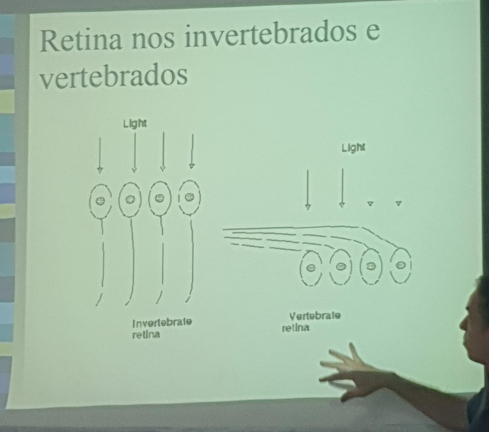

# 03/04/2024 | Visão Natural e Artificial

# Visão Natural

## Retina nos invertebrados e vertebrados

A luz nos invertebrados chega nos fotoreceptores e aí passa pela fiação de neurônios, já no olho dos vertebrados ela atravessa a fiação de neurônios para enfim atingir os fotoreceptores. 

## Tipos de olhos no reino animal

* Ocellus
* Olho de furode alfinte
* Olho composto
* Lente e retina (vertebrados)

