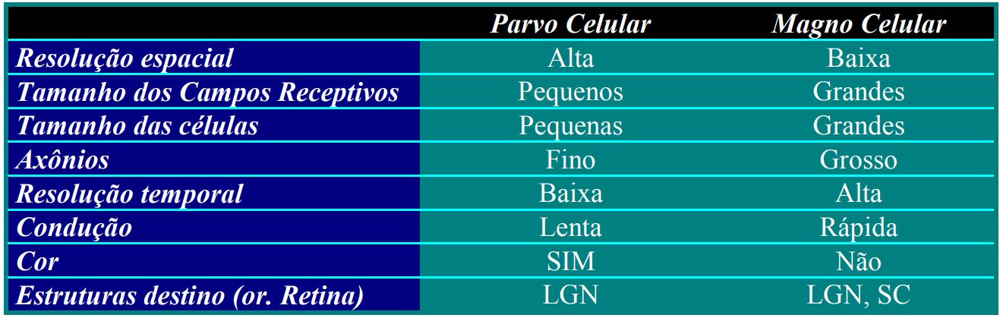

# 17/04/2024

# Visão Natural
[Slides da aula](https://scg.ifsc.usp.br/vision2024/material/visaoNatural.pdf)

## Neurônio - Revisão

### Esquema

### Glossário

- **Axônio** : Saída do neurônio. Possui uma involtura chamada de baínha de mielina, que serve pra acelerar as conexões.
- **Dendritos** : Saem do neurônio à procura de conexões com outros neurônios.
- **Sinapse** : Processo eletroquímico de conexão entre neurônios, quando um dendrito entra em contato com a extremidade de um axônio.
- **Spike** : Quando um neurônio é ativado, ele libera pulsos de sinal, ao invés de manter um sinal constante como uma onda quadrada.
- **Neuroglia** : Células que prenchem o espaço entre os neurônios e ajudam na sustentação do sistema. 
- **Massa cinzenta** : córtex.
- **Massa branca** : axônios.

## Olho humano

### Retina
- A retina possui um pedaço de córtex especializado atrás da retina, apenas para aquela função. 
- O processamento das imagens já começa, então, na retina.
- Existe um ponto cego sem cones e bastonetes na retina.
- Existem de 6 a 7mi de cones em cada olho.
- Existem de 75 a 150mi de bastonetes em cada olho.
- A retina identifica bordas (ou seja, identifica objetos), da mesma maneira que aplica-se um laplaciano em uma imagem.
- Existem dois sistemas de visão independentes: O Sistema Magno Celular, e o Sistema Parvo Celular, cada um responsável pela informação que vem dos bastonetes e cones, respectivamente.
    

