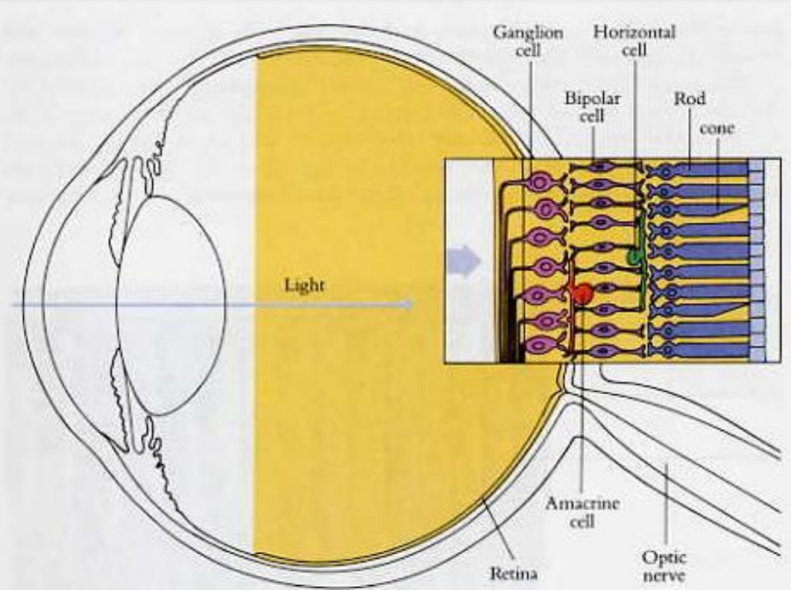
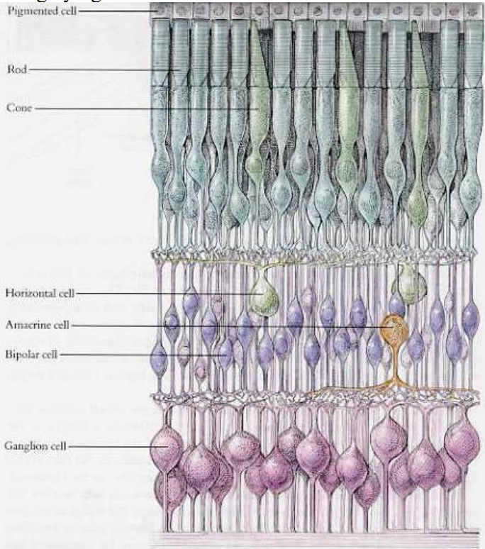
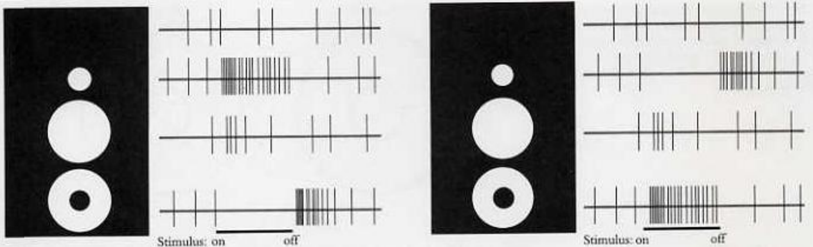
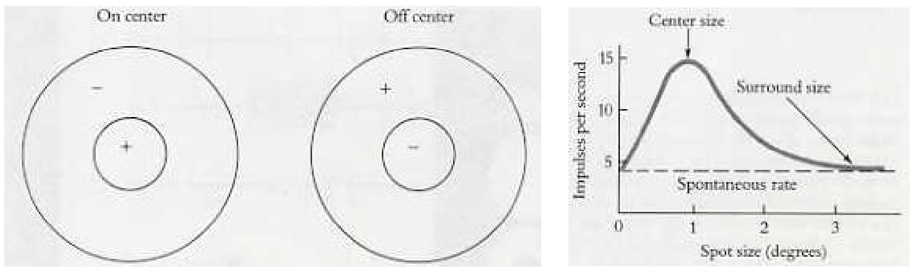
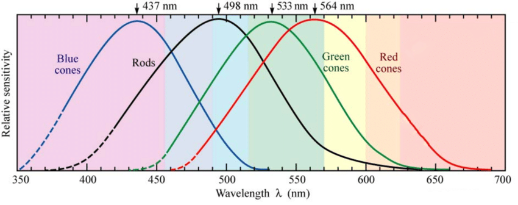
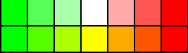
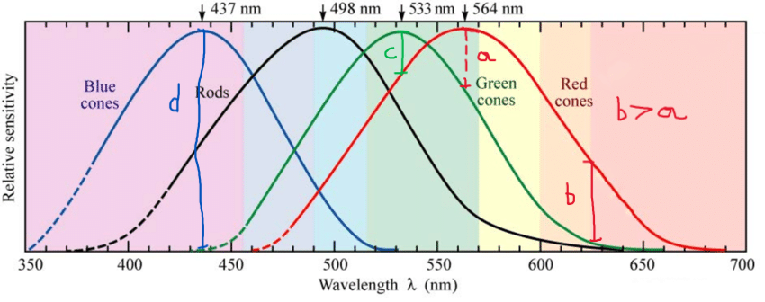
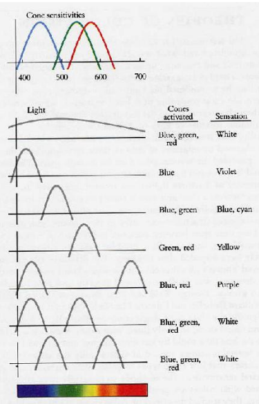

# Mapeamento de tópicos e capítulos | Eye, Brain and Vision, David H. Hubel

1. Origens da visão (ponto de vista evolutivo e etc) **(?)**
    - Retina nos invertebrados e vertebrados
    - Tipos de olhos e sistemas de visão
2. O sistema de visão primata **(Cap 3, 8)**
    - Fotorreceptores (cones e bastonetes)
    - Visão colorida
    - Distribuição de cones e bastonetes na retina
    - Processamento de imagens na retina
3. Oponência cromática de Hering e Helmholtz **(Cap 8)**
4. Sistemas de visão independentes **(?)**
    - Parvo e Magno
5. Córtex **(Cap 4, 5, 6)**
6. Paralelismo **(?)**

# Estudos

## Cap 3. O Olho

### O olho

1. A retina extrai informação importante, descartando o que é redundante.
2. O foco é regulado pelo formato da lente. Para objetos mais próximos, a lente assume um formato mais esférico, enquanto que para objetos mais distantes, a lente assume um formato mais planar. Essas mudanças são realizadas pelos músculos ciliares.
3. A quantidade de luz que entra nos olhos é regulada pela pupila. Dois conjuntos de músculos *diferentes* são responsáveis por abrir e fechar a mesma, um com disposição radial é responsável por abrir, enquanto o outro com disposição circular é responsável por fechar.
4. A limpeza do olho é realizada pelo ato de piscar, que lubrifica o olho com líquido expelido pelas glândulas lacrimais.

### A Retina

1. A retina é parte do cérebro, tendo sido "sequestrada" do mesmo no começo do desenvolvimento humano na barriga da mãe, porém de uma maneira que ainda mantenha conexões com ele por meio de fibras, chamadas de **nervo óptico**. 
2. Tem o formato de um prato, nesse caso de um quarto de milímetro de espessura, e possui **três camadas de nervos**, duas compostas de ligações entre axiônios e dendritos de células, e a última, mais ao fundo, composta dos receptores, chamados de **cones** e **bastonetes**. A primeira seria composta de **células gânglionares** e a segunda de **células bipolares**.

3. Os bastonetes, muito mais numerosos que os cones, são responsáveis pela visão em **regime de pouca luz**, ficando pouco ativos em regime de luz muito alta.
4. Cones não são muito ativos a luz baixa, porém em regime de luz alta, são responsáveis por enxergar **detalhes e cores**.
5. Cones estão mais concentrados em uma área central da retina, chamada de **fóvea**. Existem cones pelo resto da retina, porém em menor densidade. Bastonetes, por sua vez, são menos densos no meio, e mais concentrados ao redor da fóvea.
6. A luz, para chegar aos cones e bastonetes, deve passar pelas duas camadas de conexões nervosas, como explicado anteriormente. Teoriza-se que essa dinâmica não-intuitiva de captação de luz é dessa maneira pois, no fundo do olho, existe um pigmento escuro, conhecido popularmente como **melanina**. Esse pigmento impediria que a luz se refletisse de volta e se refratasse, criando uma confusão dentro da câmara escura do olho, desempenhando o mesmo papel da fundo escuro em uma câmera. além disso, as células contendo melanina também ajudariam a repor quimicamente o pigmento visualmente sensível dos receptores, que são constantemente degradados pela luz.
6. A **fóvea**, no centro do olho, é uma área com cones mais expostos. Isso ocorre pois, apesar das duas camadas de conexões nervosas serem transparentes e refratarem pouco a luz que chega, qualquer borramento é desastroso, visto que os cones trabalham em identificar detalhes, sendo assim, olho evoluiu para que essas duas camadas se dobrassem na direção radial, deixando essa área mais exposta. (Para mais detalhes, leia aqui.)[https://en.wikipedia.org/wiki/Fovea_centralis]
7. A camada do meio, entre as células ganglionares e as células receptoras, é a camada das células bipolares. Essa camada é composta de três tipos de células: as células **bipolares**, células **horizontais** e células **amácrinas**. 
    - As células bipolares alimentam as células ganglionares retinais com sinal.
    - As céluals horizontais conectam receptores e células bipolares.
    - As células amácrinas conectam células bipolares e células ganglionares.
8. A camada da frente é a camada das **células ganglionares retinais**, as quais levam o sinal coletado nas células receptoras e transmitido pelas células bipolares até o nervo óptico por terminações que passam pela superfície da retina.
9. Cada olho contém aproximadamente **$125$** milhões de cones e bastonetes, mas apenas **$1$** milhão de células ganglionares. Essa discrepância é basicamente explicada pela ideia de que por mais que todoa informação seja coletada pelos cones e batonetes, ela é pré-processada antes. A informação pode percorrer dois caminhos até o cérebro: o caminho direto, das células receptoras até as células bipolares até as células ganglionares, ou o caminho indireto, das células receptoras, passando pelo mesmo caminho, porém por intermédio das células horizontais e amácrinas. O primeiro caminho envolve apenas um conjunto pequeno de uma ou poucas mais células receptoras e ganglionares, enquanto o segundo caminho é mais difuso, usando uma quantidade maior de conexões.
10. Quanto mais no interior ou perto da fóvea, maior é a quantidade de conexões N:M:11:1:1 entre células receptoras, bipolares e ganglionares, enquanto quanto mais afasta-se dessa região, maior é a difusão dessa proporção, se tornando algo do tipo 1:1:1, ou seja, maior é o pré-processamento de informação. (?)

### O Campo Receptivo das Células Ganglionares

1. As células ganglionares são divididas em duas: **centrais** e **periféricas**.
2. As células centrais, independente de luz, disparam um sinal espontâneo ocasional de fundo. Quando é incidida luz em uma região dentro ou perto da região central do campo receptivo, um sinal é disparado a um ritmo constante. Esse fenômeno é chamado de **on response**.
3. Quando essa mesma luz incide em uma região dentro da região periférica do campo receptivo, o disparo espontâneo ocasional para, e quando essa fonte incidindo sobre a região periférica cessa, um burst instantâneo de sinal é identificado, durando uma quantidade limitada de sinal. Esse fenômeno é chamado de **off response**.
4. Essa dinâmica regional de on e off responses constitui a subdivisão do campo receptivo em regiões on e off, organizadas em regiões centrais ou periféricas circulares. Na imagem abaixo, um exemplo disso. Os maiores sinais são quando se estimula apenas uma das regiões. Se as duas são estimuladas ao mesmo tempo, é como se a célula estivesse tentando disparar mais rápido e mais lento, como uma "interferência destrutiva".
5. A concentração de células on-center (centro estimulado com luz) e off-center (centro estimulado com ausência de luz) é, aparentemente, igual. 

6. O campo receptivo de células ganglionares podem se interceptar. O menor ponto de luz incidido no olho pode estimular centenas de células.
7. Por conta de sseu estímulo radial, a orientação de objetos estimulará os campos da mesma maneira.
8. As células ganglionares **NÃO** são como pixels, com campos organizados em grids. Na verdade, seus campos receptivos se interceptam, as quais células receptoras que compõe um campo de uma célula também compõe o de outra, de maneira totalmente "desorganizada", de maneira que uma célula receptora pode disparar centenas de células ganglionares, sendo uma célula inibitória para algumas e excitatória para outras.
9. Um milímetro no olho corresponde a 3.5 graus de ângulo.
10. Os centros dos campos receptivos são menores na fóvea, provendo uma visão mais detalhada, aumentando de tamanho conforme nos aproximamos de regiões periféricas. Em macacos, o menor campo receptivo já medido corresponde a 2 minutos de arco, ou 10 micrômetros. Na fóvea, cones tem diâmetro e espaçamento de mais ou menos 2.5 micrômetros.
11. O centro do campo receptivo contribui mais para o caminho direto (receptores-bipolares-ganglionares), enquanto a periferia contribui mais para o caminho indireto (passando pelas células horizontais).

### Os fotoreceptores (cones e bastonetes)

1. O processo químico relacionado à fotorrecepção se chama "bleaching". Nesse processo, uma molécula sensível à luz absorve um fóton e é quimicamente transformada em outra que absorve menos luz.
2. O pigmento sensível a luz dos fotorreceptores tem a estrutura de uma proteína ligada a uma pequena molécula relacionada à vitamina A.
3. A dinâmica, aparentemente, envolve a diminuição de uma corrente constante que indica escuridão. A célula receptora tem sua membrana naturalmente depolarizada, permitindo a passagem de uma corrente constante de sinal ativo. O processo de bleaching aparentemente hiperpolariza esse potencial da membrana, diminuindo até cessar esse sinal constante.
4. O processo de bleaching afeta a polarização da seguinte maneira: No escuro, a membrana da célula receptora é mais permeável a íons de sódio, portanto, os mesmos fluem de fora pra dentro da célula, e íons de potássio fluem para fora. Quando ocorre o bleaching, os poros que permitem a entrada dos íons de sódio se fecham, portanto o lado de fora fica com um balanço de cargas negativas, e o lado de dentro com um balanço de cargas positivas, tornando a célula hiperpolarizada, e a corrente que antes percorria a célula, agora cessa. 
5. Os bastonetes **não** são efetivos em luz alta pois eles são tão sensíveis à mudanças de luz que apenas poucos fótons provocam o total fechamento dos poros de sódio, cessando a corrente de maneira significativa, ou seja, seu threshold é tão baixo que após esse limite, a célula não consegue perceber diferenças de contraste estando já saturada.

### Células bipolares e horizontais

1. As células bipolares participam tanto do processo direto quanto do processo indireto de transmissão de informação. As células horizontais participam apenas do processo indireto.
2. As células bipolares podem se conectar a um ou mais células receptoras. Quando ela se conecta a mais de uma receptora, esse grupo de receptoras ocupa uma área pequena na retina.
3. As células bipolares aparentemente **também devem se organizam** baseado nos campos receptivos centro-periferia, sendo assim, a organização das células ganglionares dessa maneira, se confirmada essa morfologia, é um reflexo passivo dessa organização.
4. As células horizontais se conectam a um ou mais receptores, e a uma célula bipolar. Para aonde o sinal resultante dessa célula vai, até o momento desse livro (o livro é antigo então já se deve saber), não se sabe, pois aparentemente varia de maneira significativa entre espécies.

### Células amácrinas

1. 

### Conexões entre células bipolares e ganglionares

1. 

### A significância de campos centro-periferia

1. A priori, as células ganglionares reportam informação apenas sobre as bordas de objetos.

## Cap 4. O Cortex Visual Primário

## Cap. 7

1. O efeito de profundidade psicológica se chama (stereopsis)[https://en.wikipedia.org/wiki/Stereopsis].

## Cap 8. Visão Colorida

### Receptores Visuais

1. O range de visão colorida humana é de 400 a 700 nanômetros.
2. Quando algum dos pigmentos visuais presentes nos receptores absorve luz, ele muda sua forma molecular e emite energia, desencadeando uma reação em cadeia já descrita anteriormente.
3. Quando um pigmento já absorveu luz, ele foi "bleached", ou "branqueado".
4. Nossa retina possui um tipo de bastonetes e três tipos de cones, um para a luz vermelha, outra para a verde, e outra para a azul.
5. O pigmento dos bastonetes tem um pico de absorção em, mais ou menos, $510nm$. O pigmento dos cones tem picos de absorção em: $430nm$, $530nm$ e $560nm$. Os pigmentos absorvidos de fato nesses comprimentos aparecem mais como **violeta**, **azul-esverdeado** e **amarelo-esverdeado**. 
6. As curvas de resposta dos três cones são bem largas e se sobrepõe, portanto os mesmos cones podem responder a um mesmo comprimento.

### Comentários Gerais sobre Cores

7. A existência de três cones, e não apenas um, é a seguinte:
    - Apenas um cone é equivalente a exergar apenas tons, ou seja, seria a mesma coisa que uma visão monocromática de tons de branco.
    - Apenas dois cones apresenta uma distinção de comprimentos de onda, que surge na comparação da diferença de intensidade de estímulo nos dois cones diferentes, porém na intersecção da curva de resposta desses dois, como por exemplo na interseção da curva de resposta verde e vermelha, a diferença de resposta será zero, ou seja, os dois cones estarão sendo estimulados de maneira igual, sendo interpretado como luz branca, ou seja, uma luz monocromática na intersecção dos dois, como no exemplo abaixo, a qual o amarelo seria detectato como algo próximo de um branco. Esse é um fenômeno percebido em daltônicos, que não conseguem diferir de branco pelo menos um tom de cor monocromática.
    
    - Três cones é a solução para isso, pois por contraste da estimulação da intersecção de vermelho e verde com a estimulação do azul, a intersecção é percebida como uma cor, e não como uma intensidade luminosa.
8. A explicação anterior também serve para o funcionamento dos bastonetes. Por serem estimualdos por apenas um comprimento de onda, no caso, algo entre o violeta e o verde, não conseguem distinguir comprimentos de onda, provendo então, uma percepçao monocromática. Os bastonetes funcionam sozinhos, sem serem comparados com os cones.
9. Uma maneira de entender como os bastonetes funcionam sozinhos sem diferenciar cor é enxergar o horizonte em uma noite de lua cheia. Os objetos estarão iluminados, porém sem alguma percepção de cor.
10. **A percepção de cor é o fenômeno que surge na diferença de estímulo entre os três bastones.**
11. Por mais que o pico do cone vermelho seja em $560nm$, de tom mais **amarelo-esverdeado**, a excitação em tons mais próximos da cor vermelha real é o que estimula mais os cones vermelhos com relação aos verdes, por isso talvez eles são entendidos como "cones vermelhos".

12. Duas cores são chamadas "complementares" se a sua combinação causa uma sensação de branco, como pode ser conferido abaixo:

### Teorias de Visão Colorida

### A Genética de Pigmentos Visuais

1. As sequências de aminoácidos para os pigmentos de cor vermelha e verde são 96% idênticos, enquanto os aminoácidos dos pigmentos para a cor azul e da rodopsina (pigmento dos bastonetes) são mais distantes geneticamente.

### A Teoria de Hering

1. Hering propôs que existem três processos oponentes no cérebro, olho, ou os dois: oponência azul-amarelo, vermelho-verde e branco-preto.
2. Nessa teoria, amarelo, azul, vermelho e verde seriam consideradas "cores primárias", sendo bases para a composição de outras cores, como o laranja (amarelo + vermelho) ou o violeta (azul + vermelho).
3. Como visto anteriormente, a oponência branco-preto é um fenômeno espacial, codificado nos campos receptivos centro-ligados e centro-desligados. A oponência cromática, por outro lado, não depende dessa dinâmica centro-periferia.
4. Essa teoria de dinâmica de oponência consegue explicar cores que não estão presentes no arco-íris, como por exemplo o marrom, que surge quando um laranja ou amarelo (idenntificado pela oponencia amarelo-azul e vermelho-verde) se encontra em um ambiente o qual seus arredores são mais claros (identificado pela oponência espacial branco-preto), fenômeno psicológico que decorre da mistura desses sistemas de oponência.

5. Por muito tempo as teorias de young-helmholtz e hering foram rivais, porém as duas se mostravam corretas. Enquanto a teoria de Young-Helmholtz descrevia a dinâmica a nível de receptores, a teoria de Hering descrevia a dinâmica nos processos subsequentes de recepção de luz a nível nervoso.

### Cor e a Variável Espacial

1. O fenômeno de constância de cor é quando, independente dos comprimentos de onda incidindo sobre uma peça de cor específica, essa cor irá ser compreendida como psicologicamente a mesma.
2. A oponência de cor, afinal, também depende de sua localização, como, por exemplo, oponência vermelho-verde central, ou oponência vermelho-verde periférica.
3. O resultado disso é que, assim como para intensidades de luz detectadas pelos campos receptivos branco-preto, a cor sofre o mesmo efeito espacial, ou seja, cor é um fenômeno *contextual*. É necessário contexto, ou seja, a cor em si e seus arredores, para definir que cor é aquela.

### A Base Neural da Constância de Cor

1. 

 

